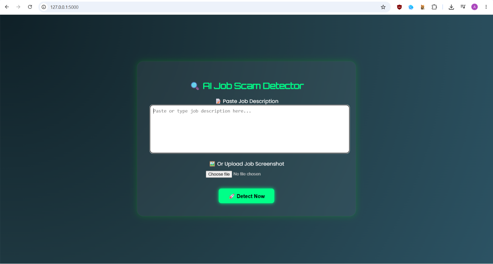
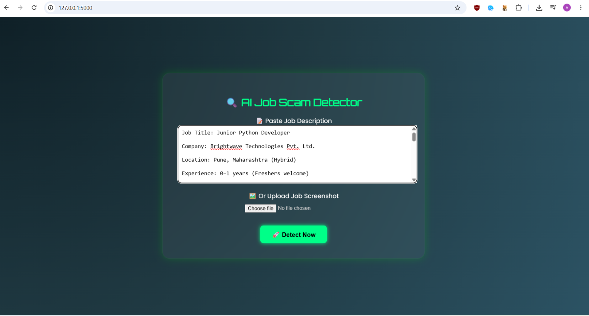
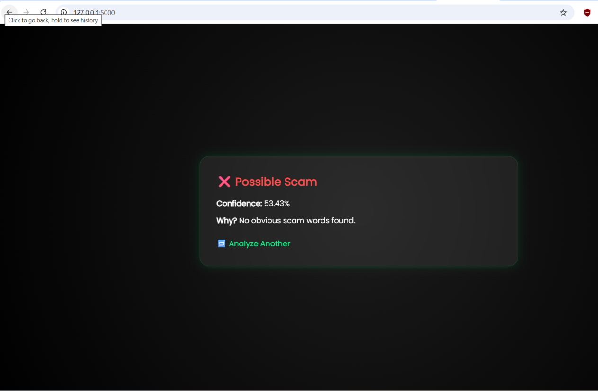

# AI Job Scam Detection System

An AI-powered web application that detects fraudulent job postings from **text input** or **uploaded images (OCR)**. Built to help job seekers quickly verify whether a job listing is likely genuine or a scam.

## Features

- 🔍 **Text Analysis** — Paste a job description and get an instant scam probability score
- 🖼️ **Image/OCR Support** — Upload a screenshot of a job post (e.g. WhatsApp, LinkedIn, email) and the system extracts text via OCR before analysis
- 🤖 **ML-Based Classification** — Uses a trained scikit-learn model to flag common scam indicators (vague roles, generic email IDs, urgency language, upfront fee requests, etc.)
- ⚡ **Flask Backend** — Lightweight and easy to deploy

## Tech Stack

- **Backend:** Flask (Python)
- **ML/NLP:** scikit-learn
- **OCR:** Tesseract / pytesseract (for image-based job post detection)
- **Frontend:** HTML, CSS, JS (Jinja templates)

## Screenshot
1.simple user interface


2.enter job description(text or img )


3.predict the result


## How It Works

1. User submits a job description as text, or uploads a screenshot of a job post
2. If an image is uploaded, OCR extracts the raw text
3. The text is preprocessed and passed to the trained classification model
4. The model returns a prediction — **Genuine** or **Scam** — along with a confidence score
5. Result is displayed to the user with key red flags highlighted (if any)

## Installation

```bash
git clone https://github.com/karangobade/smart-job-scam-detector.git
cd smart-job-scam-detector
pip install -r requirements.txt
python app.py
```

Then open `http://127.0.0.1:5000` in your browser.


## Future Improvements

- Deep learning-based text classification for higher accuracy
- Browser extension for real-time scam detection on job portals
- Support for multilingual job postings

## Author

**Karan Gobade**
- Portfolio: [karangobade.github.io/portfolio](https://karangobade.github.io/portfolio)
- GitHub: [github.com/karangobade](https://github.com/karangobade)